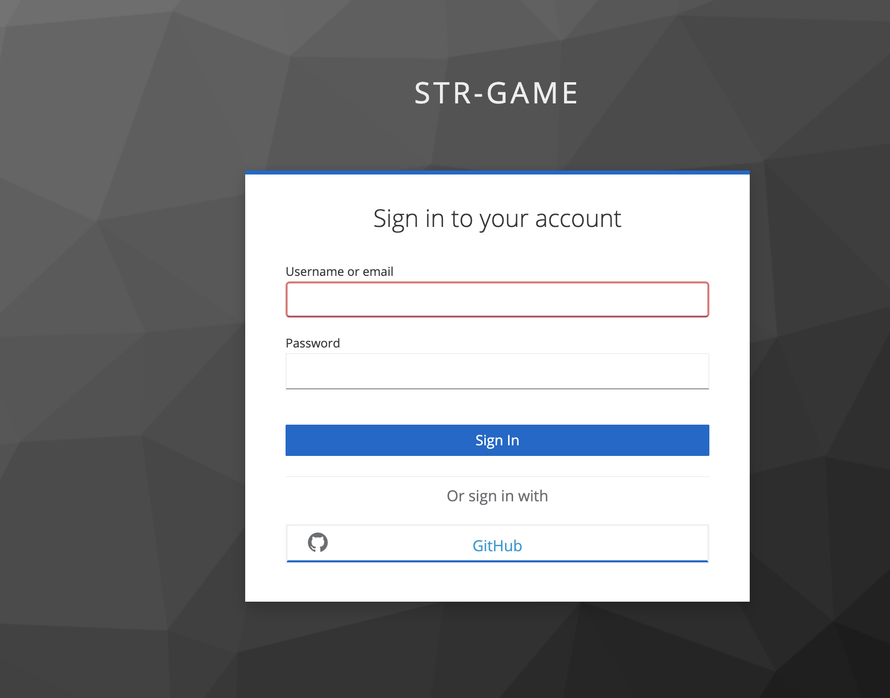
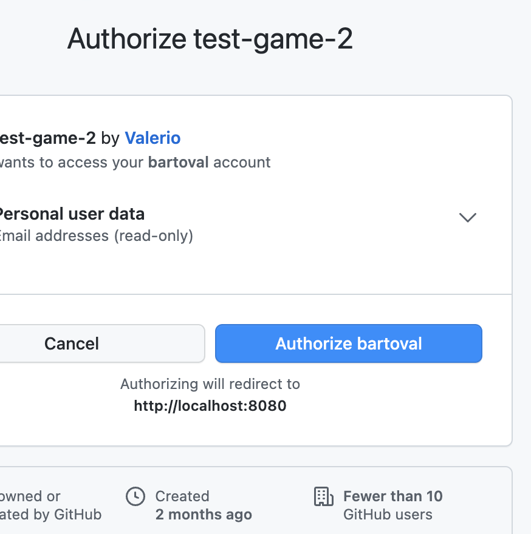
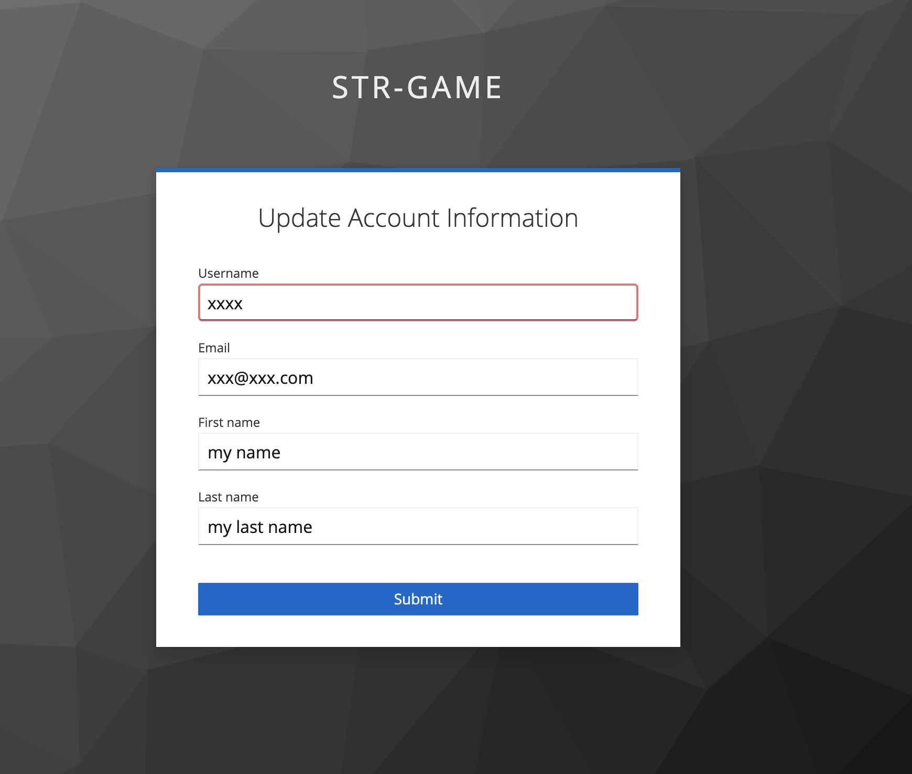

# Space Rings Thing Game Client (for Red Hat Gaming)
This repository is the Godot-based multiplayer client for the "Space Ring
Things" game. You will need to already have the [server
repository](https://github.com/redhat-gamedev/srt-godot-server) and the server's
prerequisites handled. The client also uses Protobufs for messaging, like the
server, and makes use of Git submodules in order to pull in the [Protobuf
descriptions](https://github.com/redhat-gamedev/srt-protobufs).

## How Can I Play This Game
Everything in currently in development. To play you'll need to roll up your
sleves and do a little bit of build/operations work. See the development notes
below for instructions on how to do that.

## Development Notes and Prerequisites
The game is currently being built with Linux and using Godot 3.5.1 with Mono.

This repo now uses submodules to point to the `Networking/protobufs`. Make sure to
`--recurse-submodules` when you clone. If you've already cloned prior to this
change, then run the following `git submodule update --init`.

Make sure that you are using the same commit/tag for both the client and server
in the `Networking/protobufs` folder.

### Running Your Own Everything / Testing Locally
You will need to run the game server, the AMQ messaging server, and this game
(client-side).

#### Server
Find/follow instructions for the [game server
here](https://github.com/redhat-gamedev/srt-godot-server). Once you have the
server working first, then you can run the game client with the Godot editor.

#### Client
This repo is the player game client.

If you are debugging the Godot server and Godot client on the same machine you
will want to do one of the following:

* Option 1. Goto `Editor->Editor Settings...` and search for the `Remote Port`
  setting (it's under `Network->Debug'). Change the port so that the client and
  server use different ports.
* Option 2. In the Server project, goto `Project->Export...` and export to your
  platform, then run the exported server.

#### Configuration
In the `Resources` folder is a `client.cfg.template` file. You *MUST* rename
this to `client.cfg` and change the settings to match your environment. There
are some embedded defaults, but it is likely they will not work.

## Run authentication in development
If you want to run the client against a Keycloak authentication server, you can
follow the directions below. Otherwise, set your `activate_auth_dev` to `false`.

### Run Keycloak locally using containers
The fastest and easiest way to run Keycloak in your local environment is with
the pre-built container image from the Keycloak community. The instructions
below refer to the use of Podman, but you could also use other CRIO-compliant
runtimes. Installation and configuration of Podman is left to you.

* Fast way:

``` bash
podman create --name keycloak -p 8080:8080 -e KEYCLOAK_ADMIN=admin \
-e KEYCLOAK_ADMIN_PASSWORD=admin quay.io/keycloak/keycloak:20.0.3 start-dev
```

This command will start Keycloak exposed on the local port 8080. It will also
create an initial admin user with username `admin` and password `admin`. It
names the container `keycloak`. After running the above command, you can `podman
start keycloak` or `podman stop keycloak` when you need it (or are done with
it).

The above configuration will persist the data ephemerally in the container.
Alternatively, if you want to persist an existing keycloak configuration locally
, you have to run the following command:

``` bash
podman create -p 8080:8080 -v <storage destination>:/opt/keycloak/data/h2 \
-e KEYCLOAK_ADMIN=admin -e KEYCLOAK_ADMIN_PASSWORD=admin \
quay.io/keycloak/keycloak:20.0.3 start-dev --import-realm
```

where `<storage destination>` represents an existing location on your filesystem
with write access where you want to put the persistent data.

### Setup Keycloak
The following sections describe how to configure Keycloak for authentication
against GitHub. Any authentication provider, including local users, would work.
However, we are only documenting GitHub authentication at this time.

The following sections assume you used the same port(s) and user/password
described above. If you made changes, modify accordingly.
#### Create a new realm

Go to http://localhost:8080 on your browser, then login using the credential
`admin`/`admin`.

To create a new realm:

* click on the dropdown menu on the top-left side and then click the button
  **create realm**.

* fill out a form adding the name of the new Realm and click on the button
  **create**. For example `srt-game`.


#### Configure the realm

If you are trying to test or further develop the authentication process, then
you probably want to set a short lifespan for the token token (eg: 1 minute).
In that case change *Realm setting* -> *Tokens* -> *Access Token Lifespan*


#### Create a new Client

* Go to *Clients* and press the button *Create client*


* Set the name of the new client, for example `srt-game-client-001` then and press
  the button *next*


* Enable the following flags, ensure _Client Authentication_ is enabled,  and
  press *save*


#### Configure the new Client

Keycloak must be configured with a redirect destination for after the
authentication event. In this case, that destination is the game client itself.
The default configuration for the game client is to listen for TCP connections
at the loopback address on port 31419.

Set the _Valid Redirect URIs_ to `127.0.0.1:31419` and click *Save*


#### Prepare a GitHub auth application
You now need to configure a GitHub application to allow authentication. It only
creates a set of credentials (like an API key) to allow users to authenticate to
GitHub.

*This does not grant any permissions for external users to your GitHub account.*

You may need to enable developer settings on your GitHub account. When visiting
the URL, you will be prompted to do so if required.

* Go to https://github.com/settings/developers

* Click *OAuth Apps*

* Click _New OAuth App_

* You can use anything for _Application Name_, such as "SRT Game"

* The _Homepage URL_ is not important, and can be anything, like `http://srtgame.com`

* The _Application description_ is optional.

For the last step before registering the app, you need to get the _Authorization
callback URL_ from Keycloak. Leave this page open and continue to the next
section of the instructions.
#### Configure a GitHub identity provider inside Keycloak
Go to the Keycloak administration area and make sure you are still using the
realm you created earlier (check the dropdown at the upper left).

* Click *Identity providers* in the left navigation section

* Click the _GitHub_ button

  

* Fill *Client ID* and *Client Secret* copying the values from your Github Auth app.

  In case you lost the *client secret* you can generate a new one from your
  Github Auth app. Then press *Add* (*Check for whitespace when copying and
  pasting these values*)

* As mentionated in the previous section, you must copy the *Redirect URI* from
  this Keycloak page to your Github *Oauth app*.


When you have filled out the Keycloak page for configuring the GitHub identity
provider, you can click _Add_. 

#### Register the GitHub OAuth Application

When you have successfully copined the _Redirect URI_ from this Keycloak page to
your GitHub OAuth App page, you can click _Register application_ on the GitHub
page.

### Game Client Configuration

By default, in debug mode, the authentication is disabled, to activate it you
need to configure some params. Here is a snippet of the configuration file that
pertains to the authentication configuration.

```ini
activate_auth_dev=true // Enable/disable auth

port="<set the TCP server port. Only change this if you need to change it>"; // This prop is also used to compose the valid redirect uri
address="<set TCP server address. Only change this if you need to change it>"; // This prop is also used to compose the valid redirect uri

client_id="<set the clientId with the keycloak Client ID>"; // Clients -> your client -> Client ID
client_secret="<set the client secret with the keycloak Client secret>"; // Clients -> credentials -> Client secret

auth_api_url= "<set the /auth url from keycloak>"; // Realm settings/OpenID Endpoint Configuration
token_api_url= "<set the /token url from keycloak>"; // Realm settings/OpenID Endpoint Configuration
```

* Set `activate_auth_dev` to `true`

* Do not change `port` unless you know what you are doing
* Do not change `address` unless you know what you are doing
* `client_id` is the Keycloak client account you created in the step _Create a new client_, like `srt-game-client-001`
* `client_secret` is related to the Keycloak Client, and you can find the details in the Keycloak administration interface by:
	* Selecting your SRT realm
	* Clicking _Clients_ in the left navigation
	* Clicking on the client you created earlier
	* Clicking on _Credentials_

  **Be very careful** when copying and pasting the secret to not accidentally introduce any spaces before or after the secret. 

	Good: `client_secret="Z7Be5rfu8BUtfxmLOcViU9yK1TsjkHJP"`

	Bad: `client_secret=" Z7Be5rfu8BUtfxmLOcViU9yK1TsjkHJP "`

You are now ready to test authentication. You can do this without a game server,
but you should have the AMQP broker running to prevent the client from
exploding. The AMQP broker instructions are found in the server repo.

#### Manual Test

* Run the game client and a new browser page should automatically open. Then press the button *Github*


* Allow access to GitHub


* Save your profile on Keycloak


* Close the browser tab


Now you can enjoy the game!

To make alternative tests you can let the refresh token expire. Otherwise the
refresh token will always give you a new access_token and you can enter the game
directly


